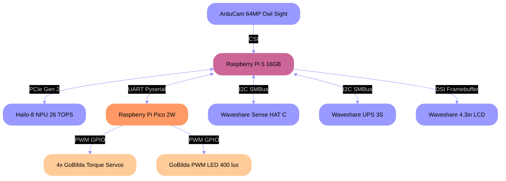

  
  
  
  

# 🤖 J1: Real-Time Computer Vision Platform and Robotic Companion

The **J1** is a robust mobile robot designed as a high-performance platform for complex **computer vision and robotics systems research**, and to function as a **friendly robotic companion**.

---
## 🛠️ Hardware: Current v1.0 & Planned Expansion 

The platform integrates specialized components and offloads low-level tasks to dedicated hardware to maximize performance on the Raspberry Pi 5.

### Current Hardware (J1 v1.0)

| Component | Brand / Model | Protocol | Purpose |
| :--- | :--- | :--- | :--- |
| **Main Compute** | **Raspberry Pi 5 (16GB)** | OS (Raspberry Pi OS) | Orchestration and microservice execution. |
| **AI Accelerator** | **Hailo-8 NPU (26 TOPS)** | **PCIe Gen 2 (4 GT/s)** | High-speed, on-device vision inference. |
| **Drive System** | **GoBilda Tumbleweed Track System** | N/A | High-traction mobile platform foundation. |
| **Motor Controller** | **Raspberry Pi Pico 2W** | UART Bus (Pyserial) | Low-level control for motors and servos. |
| **Camera** | ArduCam 64 MP Owl Sight | CSI | High-resolution primary vision source. |
| **Display** | Waveshare 4.3 in LCD Panel | DSI / Framebuffer | Local UI/Display. |
| **Battery / UPS** | Waveshare UPS 3S / INA219 | I2C Bus (SMBus) | Uninterruptible power supply and power monitoring. |
| **Onboard Sensors** | Waveshare Sense HAT(C) | I2C Bus (LGPIO/SMBus) | Body 9-DoF IMU, Environmental, ADC, and Color sensor. |
| **Actuators** | 4x GoBilda Series 2000 Torque Servos (25-2) | PWM/GPIO (Pico) | Differential drive and head pan/tilt control. |
| **Headlight** | GoBilda PWM Controlled LED (400 lux) | PWM/GPIO (Pico) | Controlled illumination for vision tasks. |

---

### Planned Sensor and Actuator Upgrades

These components are slated for integration to enable full Simultaneous Localization and Mapping (SLAM) and enhanced autonomous navigation.

| Component | Sensor Suite / Model | Protocol | Purpose |
| :--- | :--- | :--- | :--- |
| **2D Lidar** | **YDLIDAR T-Mini+** (2D Laser Scanner) | USB / Serial | Environmental mapping and feature extraction for SLAM. |
| **Depth Sensing** | **VL53L5CX** (Multizone Time-of-Flight Imager) | I2C Bus | Close-range, multi-point obstacle detection for near-field navigation. |
| **Enhanced Odometry** | **AS5600** (Track Encoders) | I2C Bus / SPI | Direct measurement of wheel rotation to improve dead reckoning accuracy. |
| **Head IMU** | **BNO085** | I2C Bus | Precisely track the head's orientation to map visual data to a known coordinate frame. |

---

## 🏗️ Hardware Architecture 

Control stability is achieved by separating high-level logic (Pi 5) from low-level, timing-critical operations (Pico).

### 🔌 Component Communication & Input Methods

| Component/Task | Protocol(s) Used | Purpose / Input Method |
| :--- | :--- | :--- |
| **Vision Inference** | **PCIe Gen 2 / GStreamer** | High-speed interface to the **Hailo-8 Accelerator** for real-time vision processing. |
| **Low-Level Control** | **USB-Serial (Pyserial)** | Main control link to the dedicated **RP2040** microcontroller. |
| **Onboard Sensing** | **I2C Bus (LGPIO/SMBus)** | Polling of all onboard sensors (IMU, environmental, power). |
| **Web Teleoperation** | **Browser Terminal / WebSockets** | LCARS-style browser terminal providing low-latency video feed and robot controls. |
| **Physical Teleoperation** | **Pygame (Controller API)** | Direct control via a Nintendo Switch Pro controller. |
| **Video Distribution** | **GStreamer, UDP, Shared Memory** | Resource-efficient pipeline for streaming raw video to multiple consumers (AI, display, web). |

---

---

## 💻 Software Architecture 

The robot's functionality is managed by **seven separate Python scripts** that communicate through a combination of methods tailored for high performance and integrity.

### Inter-Process Communication (IPC)

Scripts communicate using a combination of:
* **Port Streaming:** Low-latency video distribution via protocols like **UDP** and **GStreamer**.
* **Socket Communication:** Reliable, flexible data exchange for state and command routing via **TCP Sockets** and **WebSockets**.
* **Serial/UART Bus:** Direct, low-level data transfer with dedicated controllers like the RP2040 (via `pyserial`).
* **Atomic Shared Memory:** Utilizing NumPy files (`.npy`) and JSON files for high-speed, conflict-free state access.

### Scripts, Responsibilities, and Libraries

| Script File | Primary Responsibility | Key Libraries / Technologies |
| :--- | :--- | :--- |
| **`robot_operator.py`** | **State Orchestrator & Command Router** (The "Brain"). Manages high-level robot state and prevents command conflicts. | `selectors`, `threading` |
| **`visionstreamer.py`** | **Vision Pipeline.** Performs Hailo inference and publishes results. Splits the raw camera feed for all consumers. | `HailoRT`, `numpy` |
| **`webserver.py`** | **External Communication Bridge.** Serves the HTML frontend for control and converts the video stream into a stable HTTP MJPEG stream. | `websockets`, `asyncio` |
| **`control.py`** | **Hardware Control Interface.** Translates high-level commands into serial signals for the motor controller (Pico/RP2040). | `pyserial`, `pygame` |
| **`display.py`** | **Local UI.** Renders the LCARS dashboard, reading system performance and displaying the raw video feed. Also gives the robot personality.| `pygame`, `psutil` |
| **`sensors.py`** | **Data Ingestion.** Polling I2C sensors and publishing raw data to shared state files. | `lgpio`, `smbus` |
| **`speech.py`** | **Text-to-Speech Output.** Processes vocalization commands from the Operator. | `pyttsx3` |
| **`Pico Script (main)`** | **Hardware Control** Processes commands from the control script and controls servo's/LED's | `MicroPython` |

---

## 📅 Development Roadmap 

The following goals focus on transitioning J1 from a teleoperated platform to a fully autonomous agent.

### I. Autonomous Capabilities & SLAM

* **Full SLAM Implementation:** Integrate Lidar, ToF, and enhanced odometry data into a unified framework to create and maintain an internal map of the operating environment.
* **Complete Autonomous Logic:** Fully develop the logic within `robot_operator.py` to enable complex decision-making based on fused sensor and vision data.

### II. Design & System Upgrades

* **Sensor Suite Integration:** Complete the hardware and software integration of the planned **Lidar**, **ToF Imager**, **Encoders**, and **Head IMU**.
* **Body Design & 3D Printing:** Design and 3D print an optimized body/chassis for the J1 robot that can securely mount all new sensor components and protect the internal hardware.
